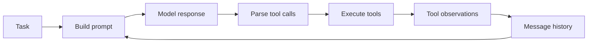

# Agent Harness Assignment 1

This repository is my first completed end-to-end agent systems assignment. I
started with the starter code for Carnegie Mellon University's 11-768 course on
AI Agents and implemented the missing agent loop, tool execution, skill loading,
context compaction, chess tools, experiments, and submission artifacts.

It is a learning project rather than a production framework. I am publishing it
as an honest record of the first time I followed a multi-part agent assignment
from an unfamiliar codebase through implementation, debugging, cloud experiments,
analysis, and final packaging.

The original problem statement and grading requirements are preserved in
[ASSIGNMENT.md](ASSIGNMENT.md).

## What I implemented

### Part 1: Coding agent

- A shared ReAct loop with prompt construction and message history.
- OpenAI-compatible tool schemas and linked tool observations.
- Terminal execution, task completion, malformed-call recovery, and trajectory
  logging.
- Skill discovery from `SKILL.md` files and on-demand skill loading.
- A generated patch for the supplied Django task and patch evaluation artifacts.

### Part 2: Context compaction

- Active-context token estimation.
- Model-generated working memory that preserves recent complete agent steps.
- Auditable compaction events in the saved trajectory.
- A full-context versus compacted-context token usage analysis.

### Part 3: Chess agent

- `play_move` for committing a move to the live board.
- `simulate_move` for stateless FEN inspection and one-ply simulation.
- `run_python` for executing model-written search code inside the remote sandbox.
- `invoke_skill` for loading a reusable chess strategy.
- Legal-move versus board-only observation experiments using DeepSeek Flash and
  GLM-4.5-Air.
- A programmatic trajectory in which the agent loads the strategy, searches with
  `simulate_move`, and commits through `play_move`.

## Core flow



`Agent` owns the reusable loop and history. `CodeAgent` and `ChessAgent` register
domain-specific tools and implement their dispatchers. Chess simulation and
model-written Python run through isolated interfaces so hypothetical moves do not
accidentally mutate the live game.

## Repository layout

- `src/assignment/agent/` — agent loop, specialized agents, tool schemas, and
  chess tool implementations.
- `tasks/` — task definitions and reusable skills.
- `tests/` — local tests supplied with the assignment.
- `artifacts/` — patches, trajectories, results, and experiment reports.
- `ASSIGNMENT.md` — original assignment specification.
- `AI_USAGE.md` — disclosure of the AI systems used while completing the work.

Some trajectories are intentionally large because they preserve complete model
requests and responses for auditability.

## Setup

```bash
git clone --recurse-submodules <repository-url>
cd <repository-directory>
uv sync
```

Copy `.env.example` to `.env` and provide credentials for an OpenAI-compatible
model endpoint. Never commit `.env`.

Check the local configuration without starting a Modal sandbox:

```bash
uv run python -m assignment.doctor
```

Run the local tests that do not require Modal:

```bash
uv run pytest -m "not modal"
```

The cloud experiments require a configured Modal account and compatible model
API credentials. See [ASSIGNMENT.md](ASSIGNMENT.md) for the original commands.

## Results and limitations

- The local non-Modal suite completed with 15 passing tests.
- The final programmatic chess trajectory reached a terminal draw.
- The observation comparison used DeepSeek Flash and GLM-4.5-Air. The original
  assignment names GPT-OSS as one of its reference models, but I used the two
  model APIs available to me and documented that substitution in the observation
  report included in the
  [submission archive](assignment-1-submission-glm.zip).
- Modal tunnel availability caused intermittent transport failures during the
  experiments; successful artifacts and relevant limitations are retained.

## Attribution

This project is based on the official
[CMU 11-768 Assignment 1 starter repository](https://github.com/cmu-agents/assignment-1).
The starter repository authors are Weiwei Sun and Saujas Vaduguru, with feedback
from 11-768 course staff (instructors Daniel Fried and Graham Neubig, and TAs
Aditya Soni, Andy Liu, Apurva Gandhi, Demi Wang, Jiarui Liu, and Yueqi Song).

My changes complete the assignment TODOs and add the generated artifacts and
documentation in this repository.
